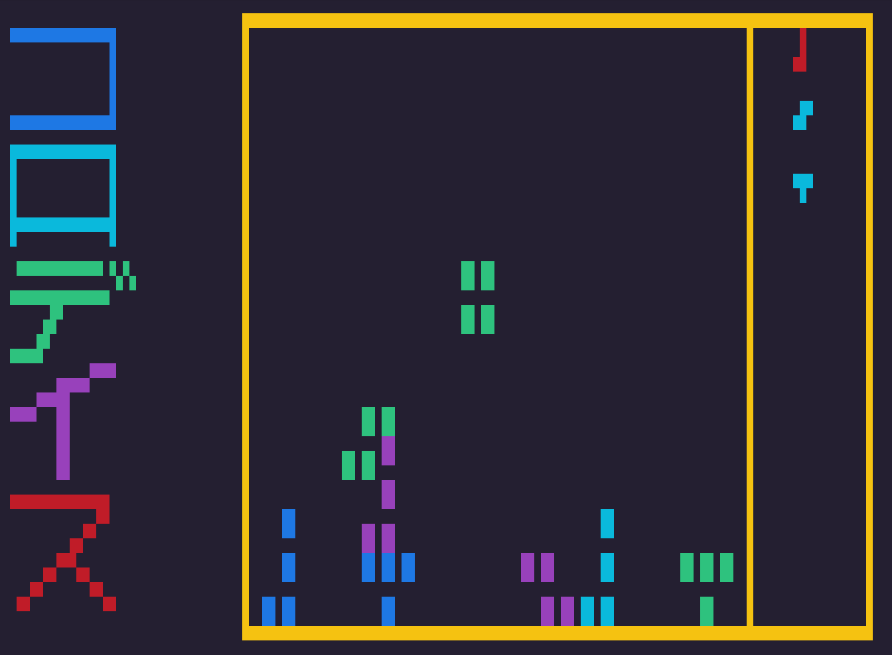

# コロディス - Corrodis

#### Yet another tetris cli in rust...

## Why? 🤔

Don't know 🤷‍♂️ I've done 0 programming project of this summer, wanted to do something,
somebody spoke to me about a todo cli in rust and 1ns later was like "yes it's clear now, the reason of my birth is surely to do yet another tetris cli game in rust" 😩

## Purpose

1. **None**
2. Seriously **idk**
3.
4. Maybe learning [ANSI escape code](https://en.wikipedia.org/wiki/ANSI_escape_code)
5. Mainly because I love rust 🦀✨
6. Easter 🥚: I speedrunned this: 16h, I think I have the any% WR now 🐢

# Limitation

**A lot**, basic game machanics have been implemented but there are a lot of bugs and undefined behavior (like x-axis collision detection), I don't even know if "clearing a line" works since I'm too bad at this game to succeed to fill one line...

It was not design with performance in mind since there are not a lot of thing to render (like max 1000 element for each frame and max 100 blocks to compute), the game is not laggy.

It _should_ only works on linux
